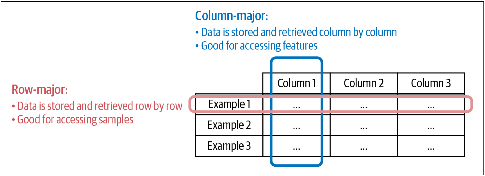
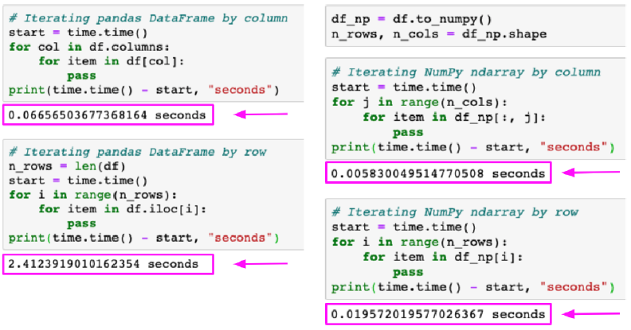

# Introduction to Deep Learning

___Textbook recap___

Student group:

- 520K0127 - Do Pham Quang Hung
- 520K0343 - Le Phuoc Thinh  


---

## CHAPTER 3: Data Engineering Fundamentals

__Designing Machine Learning Systems__
_An Iterative Process for Production-Ready Applications_


---

## Outlines

1. Data Sources
2. Data Formats
3. Data Models
4. Data Storage Engines and Processing
5. Modes of Dataflow
6. Batch Processing Versus Stream Processing
7. Summary

---

## 1. Data Sources

<font size="5">
An ML system can work with data from many different sources. They have different characteristics, can be used for different purposes, and require different processing methods. Understanding the sources your data comes from can help you use your data more efficiently.
</font>


---

## 1. Data Sources [1]

- __user input data__: data explicitly input by users. 🧝‍♀️🙎✍️
    >User input can be text, images, videos, uploaded files, etc. But if it’s even remotely possible for users to input wrong data, they are going to do it.

    > User input data can be ___easily malformatted___.

    > User input data requires more ___heavy-duty___ checking and processing.

    > *** User input data tends to require ___fast___ processing. 🥲

---

## 1. Data Sources [2]

- __system-generated data__: This is the data generated by different components of your systems 🖥️, which include various types of logs and system outputs such as model predictions.
    > Logs 📝 can record the state and significant events of the system, such as memory usage, number of instances, services called, packages used, etc.

    > these data are __less likely to be malformatted__ the way user input data is. Overall, logs don’t need to be processed as soon as they arrive.

---

## 1. Data Sources [3]

- There are also __internal databases__: generated by various services and enterprise applications in a company.
    > These databases manage their assets such as inventory, customer relationship, users, and more. This kind of data can be used by ML models directly or by various components of an ML system

    > ___First-party data___ is the data that your company already collects about your users or customers. ___Second-party data___ is the data collected by another company on their own customers that they make available to you, though you’ll probably have to pay for it. ___Third-party data___ companies collect data on the public who aren’t their direct customers.

---

## 2. Data Formats

Since your data comes from multiple sources with different access patterns, storing your data isn’t always straightforward and, for some cases, can be costly. It’s important to think about how the data will be used in the future so that the format you use will make sense.


---

## 2. Data Formats [1]

| Format | Binary/Text | Human-readable | Example use cases |
|--------|-------------|----------------|-------------------|
| JSON      | Text  | Yes  | Everywhere |
| CSV       | Text  | Yes | Everywhere |
| _Parquet_   | _Binary_            | _No_ | _Hadoop, Amazon Redshift_       |
| Avro      | Binary primary    | No | Hadoop|
| Protobuf  | Binary primary| No | Google | TensorFlow (TFRecord) |
| Pickle    | Binary        | No | Python| PyTorch serialization |

---

## 2. Data Formats [2]

__JSON (JavaScript Object Notation)__

<font size ="5">

```json
{
    "firstName": "Boatie",
    "lastName": "McBoatFace",
    "isVibing": true,
    "age": 12,
    "address": {
        "streetAddress": "12 Ocean Drive",
        "city": "Port Royal",
        "postalCode": "10021-3100"
    }
}
```

The same data can also be stored in an unstructured blob of text like the following:

```json
{
    "text": "Boatie McBoatFace, aged 12, is vibing, at 12 Ocean Drive, Port Royal, 10021-3100"
}
```

</font>

---

## 2. Data Formats [3]

__JSON (JavaScript Object Notation)__

JSON is ___ubiquitous___, the pain it causes can also be felt everywhere. Once you’ve committed the data in your JSON files to a schema, it’s pretty painful to retrospectively go back to change the schema. JSON files are text files, which means they take up a lot of space, as we’ll see in the section $\text{\color{red}“Text Versus Binary Format”}$


---

## 2. Data Formats [4]

### Row-Major Versus Column-Major Format

The two formats that are common and represent two distinct paradigms are __CSV__ and __Parquet__.

- __CSV (comma-separated values)__ is row-major, which means consecutive elements in a row are stored next to each other in memory.
- __Parquet__ is column-major, which means consecutive elements in a column are stored next to each other.

---

## 2. Data Formats [5]

### Row-Major Versus Column-Major Format


---

## 2. Data Formats [6]



---

## 2. Data Formats [7]

Column-major formats allow ___flexible column-based reads___, especially if your data is large with thousands, if not millions, of features

Row-major formats allow faster data writes.

> Overall, row-major formats are better when you have to do a lot of writes, whereas column-major ones are better when you have to do a lot of column-based reads.

---

## 2. Data Formats [8]



<font size=4>
(Left) Iterating a pandas DataFrame by column takes 0.07 seconds but
iterating the same DataFrame by row takes 2.41 seconds. (Right) When you convert the
same DataFrame into a NumPy ndarray, accessing its rows becomes much faster.
</font>

---

## 2. Data Formats [9]

### Text Versus Binary Format

- `CSV` and `JSON` are _text files_, whereas `Parquet` files are _binary files_

- Binary files are more compact

- AWS recommends using the Parquet format because “the Parquet format is up to __2x faster to unload and consumes up to 6x less storage__ in Amazon S3, compared to text formats.”

---

## 3. Data Models

<font size="5">
Data models describe <b>how data is represented</b>. Consider cars in the real world. In a database, a car can be described using its make, its model, its year, its color, and its price
</font>


---

## 3. Data Models [1]

### Relational Model

<font size = 5>
Relational models are among the most persistent ideas in computer science. Invented by Edgar F. Codd in 1970,9 the relational model is still going strong today, even getting more popular.

> data is organized into relations; each relation is a set of tuples. A table is an accepted visual representation of a relation, and each row of a table makes up a tuple

</font>


---

## 3. Data Models [2]

### Relational Model

It’s often desirable for relations to be normalized. Data normalization can follow normal forms such as the first normal form (1NF), second normal form (2NF), etc.,

---

## 3. Data Models [x1]

### No SQL

---

## 3. Data Models [x2]

### Structured Versus Unstructured Data

---

## 4. Data Storage Engines and Processing

<font size=5>
Data formats and data models specify the interface for how users can store and retrieve data. Storage engines, also known as databases, are the implementation of how data is stored and retrieved on machines. It’s useful to understand different types of databases as your team or your adjacent team might need to select a database appropriate for your application.
</font>


---

## 4. Data Storage Engines and Processing [1]

Typically, there are two types of workloads that databases are optimized for, __transactional processing__ and __analytical processing__, and there’s a big difference between them, which we’ll cover in this section. We will then cover the basics of the __ETL__ _(extract, transform, load)_ process that you will inevitably encounter when building an ML system in production.

---

## 4. Data Storage Engines and Processing [2]

### Transactional and Analytical Processing

> __Traditionally__, a transaction refers to the action of buying or selling something.


> In the __digital world__, a transaction refers to any kind of action: tweeting, ordering a ride through a ride-sharing service, uploading a new model, watching a YouTube video, and so on


---

## 4. Data Storage Engines and Processing [3]

__Transactional and Analytical Processing__

- The transactions are inserted as they are generated, and occasionally updated when something changes, or deleted when they are no longer needed. This type of processing is known as _online transaction processing_ (OLTP).

> These transactions need to be processed __fast (low latency)__ and the processing method needs to have __high availability__. Besides, if your system __can’t process__ a transaction, that transaction __won’t go through__.

---

## 4. Data Storage Engines and Processing [4]

__Transactional and Analytical Processing__

Transactional databases are designed to process online transactions and satisfy the low latency, high availability requirements. When people hear transactional databases, they usually think of ACID (atomicity, consistency, isolation, durability).


---

## 4. Data Storage Engines and Processing [4]

__Transactional and Analytical Processing__ [ACID]

_Atomicity_
> To guarantee that all the steps in a transaction are completed successfully as a group. If any step in the transaction fails, all other steps must fail also. For example, if a user’s payment fails, you don’t want to still assign a driver to that user.

_Consistency_
> To guarantee that all the transactions coming through must follow predefined rules. For example, a transaction must be made by a valid user.

---

## 4. Data Storage Engines and Processing [5]

__Transactional and Analytical Processing__ [ACID]

_Isolation_
>To guarantee that two transactions happen at the same time as if they were isolated. Two users accessing the same data won’t change it at the same time. For example, you don’t want two users to book the same driver at the same time.

_Durability_
>To guarantee that once a transaction has been committed, it will remain committed even in the case of a system failure. For example, after you’ve ordered a ride and your phone dies, you still want your ride to come.

---

## 4. Data Storage Engines and Processing [6]

__Transactional and Analytical Processing__

However, transactional databases don’t necessarily need to be ACID, and some developers find ACID to be too restrictive. According to Martin Kleppmann, “systems that do not meet the ACID criteria are sometimes called __BASE__, which stands for _Basically Available, Soft state, and Eventual consistency_. This is even more vague than the definition of ACID


---

## 4. Data Storage Engines and Processing [x]

### ETL: Extract, Transform, and Load

In the early days of the relational data model, data was mostly structured. When data is extracted from different sources, it’s first transformed into the desired format before being loaded into the target destination such as a database or a data warehouse. This process is called ETL, which stands for extract, transform, and load.

---

## 5. Modes of Dataflow

In this chapter, we’ve been discussing data formats, data models, data storage, and processing for data used within the context of a single process. Most of the time, in production, you don’t have a single process but multiple. A question arises: how do we pass data between different processes that don’t share memory?


---

## 5. Modes of Dataflow [1]

When data is passed from one process to another, we say that the data flows from one process to another, which gives us a dataflow. There are three main modes of dataflow: 
- Data passing through databases 
- Data passing through services using requests such as the requests provided by REST and RPC APIs (e.g., POST/GET requests) 
- Data passing through a real-time transport like Apache Kafka and Amazon Kinesis

---

## 5. Modes of Dataflow [2]

### [1] Data Passing Through Databases

- The easiest way to pass data between two processes is through databases. For example, to pass data from process A to process B, process A can write that data into a database, and process B simply reads from that database.

- However, doesn’t always work because of two reasons.

    > First, it requires that both processes must be able to access the same database. This might be infeasible, especially if the two processes are run by two different companies.

    > Second, it requires both processes to access data from databases, and read/write from databases can be slow, making it unsuitable.

---

## 5. Modes of Dataflow [3]

### Data Passing Through Services

---

## 5. Modes of Dataflow [x]

### Data Passing Through Real-Time Transport

---

## 6. Batch Processing Versus Stream Processing

Once your data arrives in data storage engines like databases, data lakes, or data warehouses, it becomes <b>historical data</b>. This is opposed to <b>streaming data</b> (data that is still streaming in). Historical data is often processed in batch jobs—jobs that are kicked off <i>periodically</i>.

> Read more at [Introduction to streaming for data scientists | Chip Huyen Blog](https://huyenchip.com/2022/08/03/stream-processing-for-data-scientists.html)


---

## 6. Batch Processing Versus Stream Processing [1]

- When data is processed in batch jobs, we refer to it as __batch processing__. Batch processing has been a research subject for many decades, and companies have come up with distributed systems like MapReduce and Spark to process batch data efficiently. 

- When you have data in real-time transports like _Apache Kafka_ and _Amazon Kinesis_, we say that you have streaming data. __Stream processing__ refers to doing computation on streaming data. Computation on streaming data can also be kicked off periodically, but the periods are usually much shorter than the periods for batch jobs (e.g., every five minutes instead of every day).

---

## 7. Summary

<font size="5">
In this chapter, we learned it’s important to choose the right format to store our data to make it easier to use the data in the future. We discussed different data formats and the pros and cons of row-major versus column-major formats as well as text versus binary formats.

</font>


---

## 7. Summary

---

<p align="center">
    <font size="10">
        <b>Thank you for your attention</b>
    </font>
</p>
